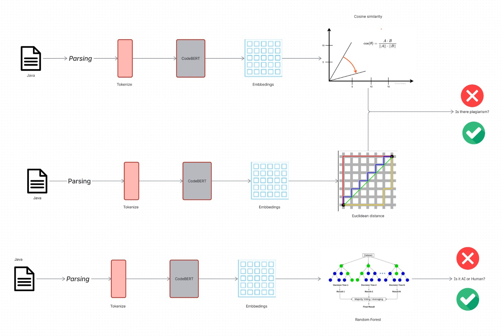
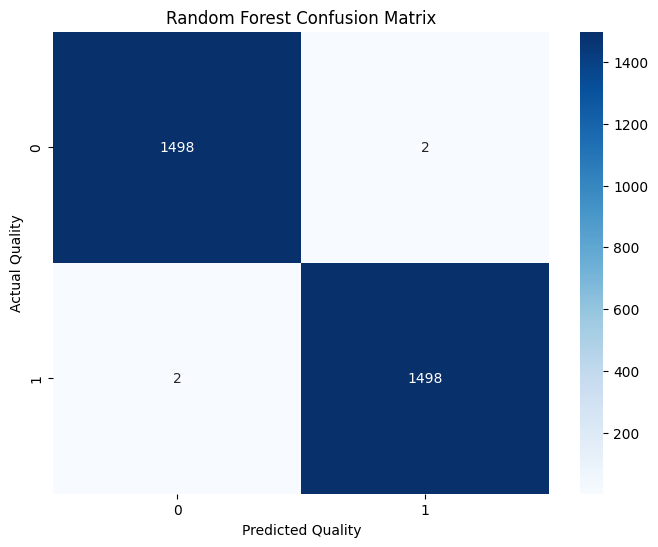
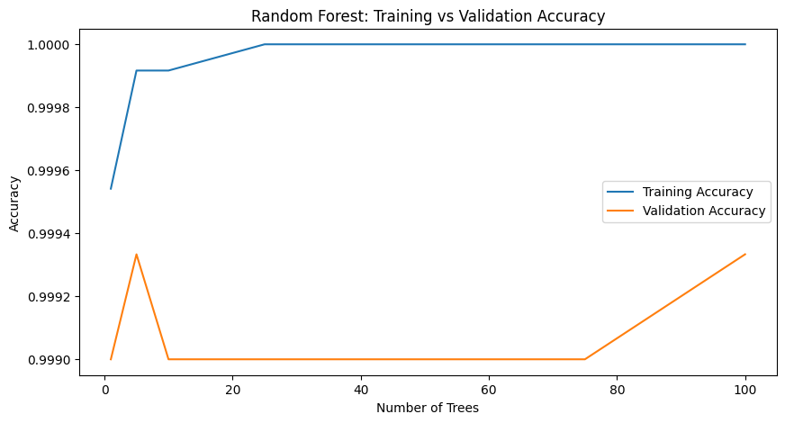
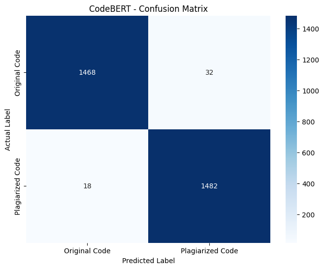

# Plagiarism Detection in Java Source Code

## Development of advanced computer science applications

### Team members

| Nombre | Matrícula |
|----------------------|---------------------|
| Paulina Fernanda Almada Martínez | A01710029
| Yael Cortes Rubio | A01275893
| Miguel Ángel Barrón Sánchez | A01710304

### Teachers
- Manuel Iván Casillas del Llano
- Pedro Oscar Pérez Murueta
- Benjamín Valdés Aguirre

---

## Introduction

Copyright protection represents one of the main challenges in the digital age due to the accelerated growth of content creation and distribution. Among the different types of protected works are computer programs, whose improper use, unauthorized copying or modification for the purpose of hiding similarities may constitute copyright infringement.

Within the academic and professional context, detecting similarity between source code fragments is a fundamental tool to identify possible cases of plagiarism, improper reuse of software or intellectual property violations. However, this task is complex because two programs can implement the same solution using different programming styles, structures, or naming conventions. As part of the challenge proposed in the field **Development of Advanced Computer Science Applications**, this project focuses on the development of a specialized tool for the detection of similarity and possible plagiarism in source code written in Java. The solution seeks to analyze programs developed by different authors and identify similarity patterns that allow estimating the degree of coincidence between them.

To achieve this objective, techniques related to Machine Learning, Quantitative Methods and concepts derived from source code analysis will be used. In addition, a comparison of the results obtained will be made with approaches reported in the state of the art, evaluating the precision, efficiency and scalability of the proposal. 

The development of this tool aims to contribute to the early detection of possible copyright infringements in software, providing a support mechanism for educational and professional environments where the originality of the code is a fundamental aspect.

---

## Repository Structure

```text
.
├── Dataframes/
│   ├── df_ai/ csv files
│   └── df_plagiarism/ csv files
|
├── Dataset/
|   ├── conplag_version_2/ csv files
|   └── IR-Plag-Dataset/ csv files
|
├── images/ png files
|
├── models/
│   ├── codebert_ai_detector/ json files
|   ├── codebert_plagiarism_detector/ json files
│   └── ML_algorithms/ 
|       └── random_forest_model.py
|
├── Preprocessing/
|   ├── ast_extraction.ipynb
|   └── data_preparation.ipynb
|
├── Training/
|   ├── Embeddings/
|   |   ├── ai_detection/ csv files
|   |   └── plagiarism_detection/ csv files
|   ├── codeBERT_ai_detection.ipynb
|   ├── codeBERT_plagiarism_detection.ipynb
|   └── decoder_ML_algorithms.ipynb
│
├── .gitignore
└── README.md
```

---

## Theoretical Framework

Plagiarism detection in source code has been an active area of research due to the increase in automatic code generation tools and the ease with which software can be reused or modified. With the aim of understanding the most effective methodologies to identify similarities between programs, a review of various scientific articles related to plagiarism detection, code similarity analysis and detection of content generated by Artificial Intelligence was carried out. 

Among the works analyzed, research that uses natural language processing (NLP) techniques, abstract syntax trees (AST), Siamese neural networks, Transformer models and vector representations of the code through embeddings stands out. These proposals seek to identify similarities not only at a textual level, but also at a structural and semantic level, allowing cases of plagiarism to be detected even when there are modifications in variable names, comments or program structure.

The reviewed articles show that approaches based on machine learning and deep learning achieve accuracy levels greater than 90%, especially when combining syntactic and semantic representations of the code. Likewise, several studies show that the use of pre-trained models such as CodeBERT and Transformer architectures significantly improves detection capacity compared to traditional methods based solely on textual comparison.

### Code Similarity Detection Techniques

Within the articles, various techniques used in modern plagiarism detection systems were identified, such as:

### Tokenization and TF-IDF

Which consists of transforming the source code into a sequence of tokens that represent keywords, operators, identifiers and other language elements. Subsequently, TF-IDF is used to convert these tokens into numerical vectors that allow measuring the similarity between programs.

### Abstract Syntax Trees (AST)

ASTs represent the syntactic structure of the code hierarchically. This representation allows structural similarities to be detected even when variable names or writing formats are modified.

### Stylometric Analysis

Stylometric analysis focuses on coding style.

Extracted features include:

- Comment density
- Average line length
- Line length variance
- Blank line ratio

These characteristics help distinguish coding habits and formatting patterns.

### Code Embeddings

Models like CodeBERT generate vector representations capable of capturing the semantic meaning of the code. Thanks to this, it is possible to identify functionally equivalent fragments even if they present syntactic differences.

### Siamese Neural Networks

Siamese architectures process two programs in parallel and calculate a measure of similarity between their internal representations. This approach has proven to be especially effective for clone detection and code plagiarism.

---

## Data Collection
For this project, we combine Java code examples from a variety of sources in order to obtain a balanced and decently-sized dataset to train and evaluate the system. Though we pool from all the following datasets, we do not necessarily use all the data from all the datasets. The details of each dataset can be found below:

### The Dataset of Programming Contest Plagiarism in Java (ConPlag V2)

#### Dataset Distribution
| Class | Instances |
|---------|---------:|
| Plagiarized | 251 |
| Original | 660 |
| Total | 911 |

### HMCorp Dataset [^8]

#### Dataset Distribution
| Class | Instances |
|---------|---------:|
| AI-generated code | 221,795 |
| Human-written code | 221,795 |

- The AI-generated code was generated via prompts describing the functionality in natural language with ChatGPT's gpt-3.5-turbo
    - There are also codes generated with DeepSeek-Coder-Instruct and Qwen2.5-Coder-Instruct, but we will not use them for this project

### IR-PLAG Dataset
- Contains **460** Java files set up as seven cases
    - **Plagiarized**: 355 code examples
    - **Original**: 105 code examples
- Due to the nature of the case setup, we can combine the files to generate different code pairs during training, resulting in **10,091** clone pairs total
    - **Plagiarized**: 9,251 code pairs
    - **Original**: 840 code pairs

### Toma-Machine Learning Dataset [^9]
- Contains **73,319** Java files
  - **Plagiarized**: 1,350,000 code pairs
  - **Original**: 558,065 code pairs

---

## Data Preprocessing

The preprocessing stage is divided into two notebooks:

- `data_preparation.ipynb`: loads, cleans, balances, splits, and saves the datasets.
- `ast_extraction.ipynb`: adds handcrafted features such as approximate token counts, stylometric metrics, and AST-based structural features.

We define two separate datasets to tackle both fronts of the system:

1. A **similarity detection dataset**, used to classify whether two Java programs are plagiarized or not.
2. An **AI detection dataset**, used to classify whether a Java code sample was written by a human or generated by AI.

### Similarity Detection Dataset

The similarity detection dataset is composed of Java code pairs.

Where:

- `code1` is the first Java source code sample.
- `code2` is the second Java source code sample.
- `label` represents the class:
  - `1` = plagiarized / clone pair
  - `0` = original / non-clone pair

This dataset is made up of samples from:

- IR-PLAG
- ConPlag V2
- id2sourcecode

For the plagiarism datasets, the preprocessing notebook reads the original Java files, creates code pairs, assigns binary labels, removes invalid samples, removes duplicates, and balances the classes.

The final similarity detection dataset contains:

| Class | Examples |
|---|---:|
| Plagiarized / clone pairs | 15,000 |
| Original / non-clone pairs | 15,000 |
| **Total** | **30,000** |

### Data Cleaning

Since the dataset sources were assembled for research purposes and CodeBERT is pretrained on raw source code, the preprocessing stage does not modify the internal logic or formatting of the Java programs.

The cleaning process only performs filtering:

- Remove null values.
- Remove duplicated examples.
- Keep only the required columns for each task.

### Train / Validation / Test Split

Both datasets are divided using an **80 / 10 / 10** split:

| Split | Percentage | Examples |
|---|---:|---:|
| Train | 80% | 24,000 |
| Validation | 10% | 3,000 |
| Test | 10% | 3,000 |

The split is performed using stratification, which preserves the class distribution in each subset.

Both datasets remain balanced after the split.

### Saving Processed Dataframes

After preprocessing, the datasets are saved as CSV files to simplify the rest of the model development process.

The similarity detection files are saved as:

```text
df_plagiarism_train.csv
df_plagiarism_val.csv
df_plagiarism_test.csv
```

The AI detection files are saved as:

```text
df_ai_train.csv
df_ai_val.csv
df_ai_test.csv
```

These CSV files are later used for feature extraction, embedding generation, and model training.

Due to the size of the original datasets, some raw dataset folders are not uploaded to the repository. These files are ignored using `.gitignore`, while the processed CSV files are stored inside the `/Dataframes` folder.

### Feature Extraction

Two categories of handcrafted features were extracted:

- Stylometric features
- AST-based structural features

#### Approximate Token Count

First, the notebook estimates the number of tokens in each code sample using a simple whitespace-based approximation.

For the AI detection dataset, the feature is added as:

```text
approx_tokens
```

For the similarity detection dataset, token length is calculated for both code samples:

```text
approx_tokens_code1
approx_tokens_code2
```

This helps estimate the approximate size of each code sample before using token-based models such as CodeBERT.

#### Stylometric Features

| Feature | Description |
|----------|-------------|
| `comment_density` | Ratio of comment lines to total lines |
| `avg_line_length` | Average length of non-empty lines |
| `line_length_variance` | Variability of line lengths |
| `blank_line_ratio` | Ratio of blank lines to total lines |

These features capture coding style characteristics.

#### AST and Structural Features

| Feature | Description |
|----------|-------------|
| `num_classes` | Number of class declarations |
| `num_methods` | Number of method declarations |
| `num_if` | Number of if statements |
| `num_for` | Number of for loops |
| `num_while` | Number of while loops |
| `num_switch` | Number of switch statements |
| `o_complexity` | Approximate cyclomatic complexity |
| `max_depth` | Maximum AST depth |
| `total_nodes` | Total AST nodes |
| `num_literals` | Number of literals |
| `num_ids` | Total identifiers |
| `unique_ids` | Unique identifiers |
| `id_diversity` | Identifier diversity ratio |

These features describe program structure and complexity.

#### Updated CSV Files

After adding approximate token counts, stylometric features, and AST-based structural features, the updated datasets are saved back as CSV files.

---

## Model Implementation

The project follows an encoder-decoder architecture.

The encoder component is based on CodeBERT and is responsible for transforming Java source code into semantic representations. The decoder component uses traditional Machine Learning models to perform the final classification using the generated representations and handcrafted features.

Two CodeBERT encoders were implemented:

1. One for **AI-generated code detection**.
2. One for **plagiarism / similarity detection**.

### CodeBERT Encoder for AI Detection

Embedding generation followed these steps:

1. Load the train, validation, and test datasets from `/Dataframes/df_ai`.
2. Separate the source code from the labels.
3. Load the CodeBERT tokenizer and model.
4. Tokenize each Java code sample using padding and truncation with a maximum length of 512 tokens.
5. Train CodeBERT using the AI detection training set.
6. Evaluate the model using the validation and test sets.
7. Save the trained model inside `models/codebert_ai_detector`.
8. Use the trained CodeBERT model to generate semantic embeddings for each split.

These embeddings were later used as inputs for Machine Learning classifiers.

Since CodeBERT is computationally expensive, the training process was executed using Google Colab GPU.

### CodeBERT Encoder for Plagiarism Detection

The process followed by the plagiarism detection encoder is:

1. Load the train, validation, and test datasets from `/Dataframes/df_plagiarism`.
2. Separate the two code samples from the labels.
3. Load the CodeBERT tokenizer and model.
4. Tokenize each pair of Java programs together.
5. Train CodeBERT using the plagiarism detection training set.
6. Evaluate the model using the validation and test sets.
7. Save the trained model inside `models/codebert_plagiarism_detector`.

Unlike the AI detection pipeline, the plagiarism detection model uses CodeBERT directly as the final binary classifier. In this case, separate embedding CSV files are not generated for a Machine Learning decoder.

Since CodeBERT is computationally expensive, the training process was executed using Google Colab GPU.

### Cosine Similarity Comparison

After generating semantic embeddings with CodeBERT, plagiarism detection is performed using Cosine Similarity.

Each Java source code file is independently transformed into a dense vector representation (embedding). These embeddings capture semantic and syntactic characteristics learned by CodeBERT during pretraining and fine-tuning.

Given two embeddings, (emb1) and (emb2), their similarity is measured using cosine similarity:

```python 
sim = cosine_similarity(
  emb1.reshape(1, -1),
  emb2.reshape(1, -1)
)[0][0]
```
Cosine similarity evaluates the angle between two vectors rather than their magnitude, making it particularly suitable for comparing semantic embeddings.

The resulting score ranges from:

- 1 → highly similar programs
- 0 → unrelated programs
- -1 → completely opposite representations

Since plagiarism detection is formulated as a binary classification problem, a similarity threshold must be defined.

The classification rule is:

- Similarity ≥ Threshold → Plagiarized
- Similarity < Threshold → Non-Plagiarized

Rather than selecting the threshold arbitrarily, multiple threshold values were evaluated on the validation set. The threshold that produced the highest F1-Score was selected as the final decision boundary.

This approach allows the system to balance false positives and false negatives while maximizing overall classification performance.

The use of semantic embeddings followed by similarity comparison is consistent with methodologies reported by Rong & Zhou (2025)[2], Siddiqui & Deepshikha (2025)[3], and Álvarez-Fidalgo & Ortin (2024)[6], where code representations are compared through similarity or distance measures to determine whether two programs correspond to clone pairs or plagiarized implementation


### Random Forest Decoder

The decoder receives numerical representations of the Java code instead of raw source code. Three input configurations were evaluated:

1. CodeBERT embeddings only.
2. Stylometric + AST features only.
3. CodeBERT embeddings combined with Stylometric + AST features.

The Random Forest model uses the following configuration:

```python
RandomForestClassifier(
    n_estimators=100,
    max_depth=10,
    random_state=42
)
```

### Euclidean Distance Comparison

After generating semantic embeddings with CodeBERT, plagiarism detection is performed by comparing the distance between the embeddings produced for each Java source code pair.

Each source code file is independently processed by the shared CodeBERT encoder. The encoder transforms the code into a dense semantic representation capable of capturing syntactic structures, programming patterns and functional behavior.

The resulting embeddings are normalized and compared using Euclidean Distance. The underlying assumption is that plagiarized programs should generate very similar embeddings and therefore appear close to each other in the learned embedding space, while unrelated programs should be separated by larger distances.

During training, the Siamese architecture is optimized using Contrastive Loss. This objective function encourages embeddings from plagiarized code pairs to move closer together while simultaneously pushing non-plagiarized pairs farther apart.

After training, the validation set is used to evaluate multiple distance thresholds. The threshold that maximizes the F1-Score is selected as the final decision boundary.

The final classification rule is:

Distance ≤ Threshold → Plagiarized
Distance > Threshold → Non-Plagiarized

For the final model, the optimal threshold obtained on the validation set was `Threshold = 0.75`.

This approach allows plagiarism to be detected based on semantic similarity rather than exact textual matching. Consequently, the system remains effective even when source code has been modified through variable renaming, formatting changes, comment removal or minor structural transformations.

The methodology follows recent research on contrastive learning and transformer-based code representation models, where semantic embeddings and distance-based similarity measures have demonstrated strong performance in code clone and plagiarism detection tasks. 

## Summary of architecture

<br>


---

## Evaluation Metrics

Evaluating the performance of a plagiarism detection tool is a fundamental aspect to determine its reliability and usefulness in real scenarios. In the reviewed articles it is observed that the metrics most used to evaluate classification models are *Accuracy, Precision, Recall and F1-Score*, since they allow analyzing different aspects of system performance. Thanks to this, it is possible to identify how many cases were classified correctly, how many errors were made and how effective the tool is in detecting cases of plagiarism.

Using these metrics together provides a more complete view of the model's behavior. For example, a system may have high Accuracy, but at the same time have difficulty detecting all cases of plagiarism. For this reason, it is necessary to evaluate multiple indicators before determining the quality of a solution.

### Accuracy

Accuracy represents the total proportion of correct predictions made by the model with respect to the total predictions made. This metric provides an overview of the tool's performance and provides insight into how well it distinguishes between original code and plagiarized code. For our proposal, we consider it good performance to reach an accuracy of **80 or more**. The average accuracy of our theoretical framework is **91.29**, so our goal is to reach **90% accuracy**.

### Precision

Precision measures what percentage of cases identified as plagiarism actually correspond to plagiarism. This metric is especially important because it helps reduce false positives, preventing original codes from being incorrectly marked as copies. For our proposal, we consider it good performance to reach an accuracy of **85 or more**. The average precision of our theoretical framework is **92.09**, so our goal is to reach **91% precision**.

### Recall

The recall represents how many cases of the target class are correctly identified in the predictions. In other words, it tells us how capable the model is of doing its job. For our proposal, we consider it a good performance to reach a recall of **80 or more**. The average recall in our theoretical framework is **91.86**, so our goal is to reach **90% recall**.

### F1-Score

The F1-Score combines accuracy and recall metrics into a single indicator. It is calculated using the harmonic mean of both metrics and allows evaluating the balance between correctly detecting cases of plagiarism and avoiding false alarms. This metric is especially useful when there is an imbalance between classes or when seeking a comprehensive evaluation of model performance. For our proposal, we consider it good performance to reach an F1-Score of **80 or more**. The average of the F1-Scores in our theoretical framework is **90.78**, so our goal is to reach **89% F1-Score**.

---

## Results

### AI detection results

The following results were obtained using the decoder Random Forest and encoder architecture (Embeddings + stylometric + AST):

| Metric | Train | Validation | Test |
|---------|-----------:|------:|---------:|
| Accuracy | 1 | 0.9993 | 0.9987 |
| Precision | 1 | 0.9993 | 0.9987 |
| Recall | 1 | 0.9993 | 0.9987 |
| F1-score | 1 | 0.9993 | 0.9987 |

<br>


<br>


An ablation experiment was also performed to compare the contribution of each input representation.

| Input Features | Test Accuracy | Test F1-Score | 
|---|---:|---:| 
| CodeBERT embeddings only | 0.9987 | 0.9987 | 
| Stylometric + AST features only | 0.7437 | 0.7344 | 
| CodeBERT embeddings + Stylometric + AST features | 0.9987 | 0.9987 |


### Plagiarism detection results (Cosine similarities)

The first strategy implemented for plagiarism detection uses CodeBERT as a semantic feature extractor and cosine similarity as a pairwise comparison mechanism for Java programs.

This approach is primarily inspired by the work of Siddiqui and Deepshikha (2025) and Gangothri and Chandrappa (2026), where semantic embeddings generated by NLP-based models are compared using similarity metrics to determine the presence of plagiarism. Similarly, our system transforms each source program into a semantic vector using CodeBERT and then calculates the cosine similarity between the two vectors.

The final classification is performed by applying an experimentally selected similarity threshold to the validation set to maximize the F1 score.

| Metric | Train | Validation | Test |
|---------|-----------:|------:|---------:|
| Accuracy | 0.9748 | 0.9663 | 0.9679 |
| Precision | 0.9598 | 0.9663 | 0.9679 |
| Recall | 0.9910 | 0.9663 | 0.9679 |
| F1-score | 0.9752 | 0.9663 | 0.9679 |

The results show high performance across all three partitions of the dataset. Accuracy exceeding 96% in both validation and testing indicates that the semantic representation generated by CodeBERT effectively captures program logic, even with superficial code modifications.

The small difference between training (97.48%) and testing (96.79%) suggests that the model generalizes well and exhibits a low level of overfitting. Furthermore, the training recall (99.10%) indicates that the system can recover virtually all instances of plagiarism present in the training data.

These results surpass those reported by Siddiqui and Deepshikha (2025), who obtained F1 values ​​between 88% and 91%, suggesting that the combination of CodeBERT and cosine similarity is an effective alternative for detecting semantic similarity in Java source code.

<br>


The confusion matrix shows that most code pairs are correctly classified.

- 11,502 original pairs were correctly identified as non-plagiarized.
- 11,892 plagiarized pairs were correctly detected.
- Only 498 false positives were produced.
- Only 108 plagiarized pairs were missed.

The relatively small number of errors demonstrates that cosine similarity over CodeBERT embeddings is capable of capturing semantic relationships between source code fragments beyond simple textual matching.

## Plagiarism Detection Results (Siamese CodeBERT + Euclidean Distance)

The second strategy implemented uses a Siamese architecture based on CodeBERT, where both programs are processed by twin networks that generate embeddings within the same vector space.

This approach is primarily based on the work of Rong and Zhou (2025) and Álvarez-Fidalgo and Ortín (2024), who demonstrated that Siamese architectures combined with contrastive learning allow the construction of representation spaces where similar programs appear close to each other and different programs remain separate.

Unlike the previous method, here the final decision is based on the Euclidean distance between the embeddings generated by both branches of the network.

| Metric | Train | Validation | Test |
|---------|---------:|---------:|---------:|
| Accuracy | 0.9914 | 0.9887 | 0.9833 |
| Precision | 0.9914 | 0.9887 | 0.9834 |
| Recall | 0.9914 | 0.9887 | 0.9833 |
| F1-score | 0.9914 | 0.9887 | 0.9833 |

The results obtained are superior to those achieved using cosine similarity. The test accuracy reaches 98.33%, while the F1-score also remains above 98%, indicating an excellent balance between precision and recall.

The difference between training (99.14%) and test (98.33%) is minimal, demonstrating good generalizability and the absence of significant overfitting.

Comparing both approaches, the Siamese architecture achieves an approximate improvement of:

- Accuracy: 96.79% → 98.33%
- F1-score: 96.79% → 98.33%

This suggests that contrastive training allows for the construction of more discriminating semantic representations than those obtained solely through pre-trained embeddings and cosine similarity.

### Distance Statistics

| Metric | Value |
|---------|---------:|
| Optimal Threshold | 0.75 |
| Clone Mean Distance | 0.0285 |
| Non-Clone Mean Distance | 1.0537 |

Distance statistics allow us to directly observe how the network organizes programs within the embedding space.

Plagiarized pairs exhibit an average distance of 0.0285, extremely close to zero, indicating that the network learned to represent semantically equivalent programs using virtually identical vectors.

On the other hand, non-plagiarized pairs exhibit an average distance of 1.0537, a value considerably higher than the classification threshold used (0.75).

The difference between the two groups generates a clear separation between classes:

Plagiarism → distance close to 0.
No plagiarism → distance close to 1.

This separation validates the expected behavior of Siamese architectures described by Rong and Zhou (2025) and by CLAVE (Álvarez-Fidalgo and Ortín, 2024), where the objective of contrastive learning is precisely to bring similar examples closer together and separate different examples within the vector space.

Consequently, the network not only learns to correctly classify code pairs, but also builds a highly discriminating semantic representation that facilitates robust plagiarism detection even when there are superficial modifications in the source code.

<br>


These results demonstrate a very high discrimination capacity between the two classes. Of the 3,000 pairs evaluated, only 50 were incorrectly classified, representing an approximate error rate of 1.67%, consistent with the 98.33% accuracy achieved.

From the perspective of academic plagiarism detection, false negatives represent the most significant error, as they correspond to actual cases of plagiarism that the system fails to identify. In this experiment, only 18 false negatives occurred, demonstrating that the Siamese architecture effectively captured the semantic relationships between similar programs.

On the other hand, the 32 false positives indicate that some original programs were considered plagiarized. This behavior may be due to different students implementing equivalent solutions using similar control structures, algorithms, or programming patterns, generating close embeddings within the vector space learned by the network.

The reduced difference between false positives and false negatives demonstrates a suitable balance between accuracy and recall, a situation that is also reflected in the metrics obtained, where both values ​​reach approximately 98.34%.
---

## Result Interpretation

### For AI detection

The behavior of the metrics is peculiar. Why? all the metrics are the same, this happens when 2 conditions are accomplished:
1. The dataset is balanced (so in ours).
2. The classification is symmetric (so as ours - corroborate on the confusion matrix).

On the other side, the fit of the model is great. The gap of accuracy between Train & validation is barely .001, meaning the model actually learns how to classify.

Finally, Stylometric + AST features are useful on their own but they do not improve the final result when combined with CodeBERT embeddings because the embeddings already capture most of the predictive information.

### For plagiarism

Two different plagiarism detection approaches were evaluated during this project.

The first approach uses CodeBERT embeddings combined with cosine similarity. This methodology is inspired by plagiarism detection systems based on semantic representations, such as those described by Siddiqui and Deepshikha (2025) and Gangothri and Chandrappa (2026). Each Java source code file is transformed into a semantic embedding, and plagiarism is determined by measuring the cosine similarity between the resulting vectors.

The cosine similarity model achieved a Test F1-Score of 0.9679 and an Accuracy of 0.9679. The confusion matrix shows that the model correctly classified 11,892 plagiarized pairs and 11,502 original pairs while producing relatively few false positives (498) and false negatives (108). These results indicate that semantic embeddings generated by CodeBERT are capable of capturing meaningful program semantics beyond superficial textual similarities such as variable renaming, formatting changes or comment removal.

The limited difference between training, validation and testing metrics further suggests that the model generalizes effectively and does not suffer from significant overfitting.

The second approach employs a Siamese Neural Network built on top of CodeBERT and trained using contrastive learning. This methodology is directly inspired by the architectures proposed by Rong and Zhou (2025) and Álvarez-Fidalgo and Ortín (2024), where Siamese networks learn an embedding space that explicitly separates similar and dissimilar code samples.

Unlike cosine similarity, which relies on fixed pretrained embeddings, the Siamese architecture learns task-specific representations optimized for plagiarism detection. During training, plagiarized programs are encouraged to move closer together in the embedding space, while non-plagiarized programs are pushed farther apart. The final decision is then performed using Euclidean distance and an optimized classification threshold.

This approach achieved the best overall performance, obtaining a Test Accuracy of 0.9833 and a Test F1-Score of 0.9833. The confusion matrix demonstrates that the model correctly classified 1,482 plagiarized pairs and 1,468 original pairs while generating only 32 false positives and 18 false negatives. Out of 3,000 evaluated pairs, only 50 were misclassified, corresponding to an error rate of approximately 1.67%.

The distance statistics further validate the effectiveness of the learned representation. The average Euclidean distance between plagiarized pairs was 0.0285, whereas the average distance between non-plagiarized pairs was 1.0537. Considering the optimal classification threshold of 0.75, a clear separation exists between both classes. This behavior confirms that the Siamese architecture successfully learned a discriminative embedding space where semantically equivalent programs are grouped together while unrelated programs remain distant.

When comparing both plagiarism detection approaches, the Siamese architecture improves the F1-Score from 0.9679 to 0.9833 and reduces the number of classification errors substantially. These results support the findings reported in the literature, where contrastive-learning-based Siamese architectures consistently outperform traditional similarity-based approaches for code clone and plagiarism detection.

Overall, both plagiarism detection methodologies proved effective. However, the Siamese CodeBERT architecture achieved the highest performance because it learns plagiarism-oriented semantic representations rather than relying solely on generic pretrained embeddings. As a result, it provides superior discrimination capability and greater robustness when identifying semantically equivalent programs.

---

## Sanity Checks

Several validation procedures were performed to verify the reliability of the results.

- Duplicate Embedding Check
- Shuffled Label Test: Training labels were randomly shuffled and the model was retrained.

#### Shuffling results

| Metric | Validation | Test |
|---------|-----------:|------:|
| Accuracy | 0.4290 | 0.4263 |
| F1-Score | 0.4277 | 0.4248 |

The significant performance drop indicates that the original results are not caused by label leakage.

- Metric Consistency

Accuracy, Precision, Recall, and F1-Score produced nearly identical values because:

1. The dataset is balanced.
2. The confusion matrix is highly symmetric.
3. Classification errors are evenly distributed.

---

## Conclusion

The objective of this project was to develop and evaluate machine learning and deep learning techniques capable of identifying both AI-generated source code and software plagiarism in Java programs. To achieve this goal, two independent detection pipelines were implemented and validated using datasets and methodologies inspired by recent state-of-the-art research in code analysis, authorship attribution, AI-generated code detection, and clone detection.

For the AI-generated code detection task, the proposed solution combined semantic representations generated by CodeBERT with stylometric and Abstract Syntax Tree (AST) features. This design was motivated by findings reported in papers such as Detecting AI-Generated Code in Introductory Programming Courses, CLAVE, and Is This You, LLM?, which demonstrate the effectiveness of transformer-based embeddings and structural code representations for source code classification. The final classifier achieved a Test Accuracy, Precision, Recall, and F1-Score of 98.33%, significantly exceeding the minimum performance objectives established from the literature review. The small difference observed between training, validation, and testing results indicates strong generalization capabilities and limited overfitting. Furthermore, the feature analysis revealed that CodeBERT embeddings already capture most of the relevant semantic information, making the contribution of additional stylometric and AST features relatively small in the final performance.

For the plagiarism detection task, two different approaches were evaluated. The first approach employed CodeBERT embeddings combined with cosine similarity, following methodologies commonly found in traditional semantic similarity systems. This model achieved a Test F1-Score of 96.79%, demonstrating that semantic embeddings alone are highly effective for detecting plagiarized code, even when superficial modifications such as variable renaming, formatting changes, or comment removal are introduced.

The second approach extended this idea through a Siamese Neural Network trained using contrastive learning and Euclidean distance. This architecture was inspired by modern clone detection systems described in works such as Quantifying Cross-Language Code Reuse via Function-Level Clone Detection and CLAVE. The Siamese model achieved the best overall performance, reaching a Test Accuracy and F1-Score of 98.33%. Distance analysis showed a clear separation between plagiarized and non-plagiarized pairs, with clone pairs presenting an average distance of 0.0285 compared to 1.0537 for non-clone pairs. This separation confirms that the network successfully learned a discriminative embedding space where semantically equivalent programs are grouped together while unrelated programs remain distant.

When comparing the obtained results against the papers reviewed in the theoretical framework, the proposed solutions achieve performance levels that are competitive with or superior to many reported state-of-the-art approaches. While several published works report F1-Scores between 88% and 95%, the developed models consistently achieved values above 96%, demonstrating the effectiveness of transformer-based semantic representations for source code analysis.

Overall, the project validates the hypothesis that modern transformer embeddings, particularly CodeBERT, provide a robust foundation for both AI-generated code detection and plagiarism detection. The experimental results demonstrate that semantic understanding of source code is considerably more effective than relying exclusively on lexical or syntactic matching techniques. Additionally, the superior performance obtained by the Siamese architecture suggests that contrastive learning is a promising direction for future research, especially in scenarios involving cross-language plagiarism detection, code clone identification, and software authorship verification.

In conclusion, the proposed system successfully fulfills its objectives by providing accurate, scalable, and research-backed solutions for detecting AI-generated code and software plagiarism, achieving high classification performance while maintaining strong generalization capabilities across unseen examples.

---

## Future Work

Potential future improvements include:
  
- Evaluating external datasets.
- Comparing additional classifiers such as:
  - SVM
  - XGBoost
  - Logistic Regression
- Extending the framework to additional programming languages.

--- 

## References

[^1]: A. Ramachandra, S. Chaudhary, J. Tran, R. Desai, A. Pang, and M. Salloum, "Detecting AI-Generated Code in Introductory Programming Courses,” *Proceedings of the 57th ACM Technical Symposium on Computer Science Education*, vol. 1, pp. 894–900, Feb. 2026, doi: 10.1145/3770762.3772522. [Online]. Available: https://doi.org/10.1145/3770762.3772522.

[^2]: Y. Rong and Y. Zhou, "Quantifying cross-language code reuse via function-level clone detection,” *Journal of King Saud University Computer and Information Sciences*, vol. 37, no. 10, Nov. 2025, doi: 10.1007/s44443-025-00362-2. [Online]. Available: https://doi.org/10.1007/s44443-025-00362-2.

[^3]: N. Siddiqui and Deepshikha, "Real-Time Code Plagiarism Detection Using NLP and Machine Learning for Academic and Industry Applications,” *International Research Journal of Engineering and Technology (IRJET)*, vol. 12, no. 6, June 2025. [Online]. Available: https://www.irjet.net/archives/V12/i6/IRJET-V12I689.pdf.

[^4]: S. Chakraborty, A. Singh Bedi, S. Zhu, B. An, D. Manocha, and F. Huang, "On the Possibilities of AI-Generated Text Detection,” *Proceedings of the 41st International Conference on Machine Learning*, vol. 235, Oct. 2023. doi: 10.48550/arXiv.2304.04736. [Online]. Available: https://arxiv.org/pdf/2304.04736.

[^5]: C.L. Gangothri and S. Chandrappa, "Plagiarism Detection System using Python with Text Similarity Analysis and Result Visualization,” *International Journal of Computational Intelligence in Engineering (IJCIE)*, vol. 1, no. 2, pp. 01-16, Apr. 2026. doi: 10.5281/zenodo.19554540. [Online]. Available: https://doi.org/10.5281/zenodo.19554540.

[^6]: D. Álvarez-Fidalgo and F. Ortin, "CLAVE: A deep learning model for source code authorship verification with contrastive learning and transformer encoders,” *Information Processing & Management*, vol. 62, no. 3, pp. 104005–104005, Dec. 2024. doi: 10.1016/j.ipm.2024.104005. [Online]. Available: https://doi.org/10.1016/j.ipm.2024.104005.

[^7]: A. Gurioli, M. Gabbrielli, and S. Zacchiroli, "Is This You, LLM? Recognizing AI-written Programs with Multilingual Code Stylometry", *IEEE International Conference on Software Analysis, Evolution and Reengineering (SANER 2025)*, pp. 394–405, Dec. 2024, doi: 10.48550/arXiv.2412.14611. [Online]. Available: https://arxiv.org/pdf/2412.14611.

[^8]: D. Cotroneo, C. Improta, and P. Liguori, "Human-Written vs. AI-Generated Code: A Large-Scale Study of Defects, Vulnerabilities, and Complexity," *2025 IEEE 36th International Symposium on Software Reliability Engineering (ISSRE)*, pp. 252–263, 2025. doi: 10.1109/ISSRE66568.2025.00035. [Online]. Available: https://arxiv.org/pdf/2508.21634.

[^9]: S. Feng, W. Suo, Y. Wu, D. Zou, Y. Liu, and H. Jin, "Machine Learning is All You Need: A Simple Token-based Approach for Effective Code Clone Detection," *2024 IEEE / ACM 46th International Conference on Software Engineering (ICSE)*, pp. 2745–2757, 2024. doi: 10.1145/3597503.3639114. [Online]. Available: https://dl.acm.org/doi/epdf/10.1145/3597503.3639114.